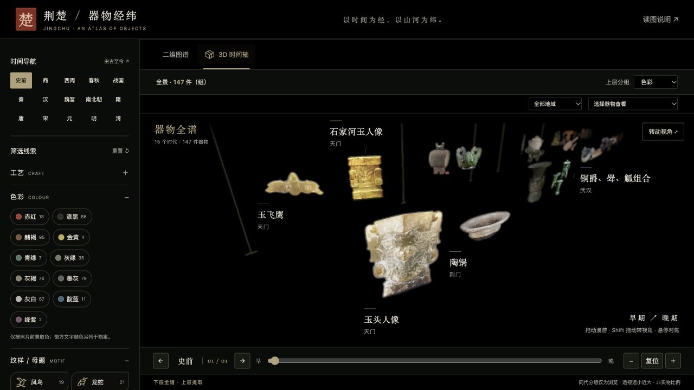

# 荆楚 · 器物经纬

荆楚器物的交互式时间图谱，收录 **147 件（组）器物、15 个时代分段、15 个城市/出土地待核分组**，由史前延续至清代。

在线访问：<https://roibai.github.io/cultureMuseum/>

- 全站沿用编钟体验的黑底、青铜绿与哑金配色；二维图谱、三维场景、器物档案和横向比对共用主题。
- 待补证、待核等缺失信息只保留在资料中，不作为筛选或比对分类。
- 时代纵向排列，器物在同一时代内按出土地分组。战国、清代等密集时代按正常图片尺寸分排，横向适配屏幕；同代不同排不表示先后。
- 左侧点击时代直接跳转。每个城市有固定、独立的背景底色。未收录器物的时代不显示。
- 按工艺、照片色彩、纹样/造型母题、材质和出土地筛选：同类取并集，跨类取交集；匹配器物高亮，其余淡化。
- 色彩用实色线，纹样用稀疏重复母题，工艺用虚线与工具图标，材质用纹理色带。路径在器物之间转折，表达特征关联，不直接代表历史传承。
- Three.js「3D 时间轴」使用透视镜头，时间从左下前景延伸至右上深处。器物以相同世界尺寸、不同前后位置悬浮，呈现近大远小、遮挡、视差和基于深度纹理的轻度景深虚化；没有展台底板。点击“转动视角”后拖动，或按住 Shift 拖动，可调整观察角度。器物仅在悬停/键盘聚焦时转向镜头并对焦，旁侧显示信息；点击打开档案。
- 器物名称是独立水平标签，桌面 16px、窄屏 15px，不随透视缩小。标签避让相邻图片和文字；远处拥挤标签暂隐，悬停可查看名称。拖动、滚轮或滑块连续漫游，左右按钮/方向键逐组停靠；窄屏逐件停靠。战国 21 组、清代 5 组，浏览分组不表示年代细分。
- 三维筛选会将匹配器物从完整底层升至上层，镜头同步上移。可按色彩、纹样、工艺、材质或出土地分组，每组内部按时代排列；底层全谱保留。系统减少动态效果设置会关闭升降过渡。
- 点击器物进入独立详情页：整器与局部放大窗连线，支持拖动、滚轮、双指和键盘缩放，查看工艺、纹样、彩绘及来源。返回时间轴恢复筛选与浏览位置。
- 横向比对将当前器物固定在左侧，右侧独立滚动；纹样和工艺使用对应照片局部，颜色和材质保留整器。可更换参照物，或在详情页保存本次会话的观察区域。
- 花卉/植物范围经来源核对，排除 7 条误标后为 12 件；鸟类合并凤鸟与禽鸟并去重，共 30 件。来源有记载但照片不能清楚呈现时，会明确标注。
- 曾侯乙编钟档案可进入“探索编钟的声音”，复用独立 `chime-portal` 的青铜配色版本：旋转三维编钟、点击敲击、播放或停止《楚歌》。49 个模型钟体使用不同的复制件录音作演示配声。

器物细读与比对：[莲花盖豆](https://roibai.github.io/cultureMuseum/object.html?id=dou) · [花卉/植物比对](https://roibai.github.io/cultureMuseum/compare.html?id=dou&by=motifs&value=%E8%8A%B1%E5%8D%89)

新版三维交互预览：



## 地图与纹样工坊

- [荆楚地图](https://roibai.github.io/cultureMuseum/?view=map)：Three.js 低起伏地形，切边厚度 0.24 世界单位，地形高程比例 0.00105。地图使用现代湖北边界定位，不表示历史楚国疆域。
- 49 处出土记录对应 127 件器物；20 件缺少可靠出土地的不虚设点。城市范围坐标采用空心点，同坐标记录合并显示，仍保留各出处。42 件有明确出土年份，原文证据在 `dist/map-data/excavations.json`。
- 展演默认按**器物所属年代**排序，可另外切换为出土年份。地图慢速旋转，光束从地表升起，器物逐次浮现、放大、缩小；支持暂停、逐件切换、速度及进度调整。筛选与年代导航沿用图谱侧栏。
- [纹样工坊](https://roibai.github.io/cultureMuseum/workshop.html)：77 件带纹样标签的器物、137 条母题记录。120 张照片数字拓影可收藏、下载透明 PNG、加入设计；17 条照片无法辨清的记录只保留出处。
- 采用去噪、轮廓提取和彩绘色区分离，输出明确线条；默认使用完整团凤纹，玉佩凤首局部另标造型拓影。工作台提供线条粗细、图层配色、大小、旋转、镜像、透明度、拖动与键盘定位，最多 8 层；单组、齐列、错位、镜像排布及横纵间距可调。
- 织物、青铜、瓷器、漆木、玉石共 5 种程序纹理，每种 6 个底色，也可自选色。范铸、刺绣、釉下彩、雕琢、雕漆均先显示馆方知识与图片出处，再按底材适用范围添加示意效果。
- 设计自动保存在本地浏览器，支持撤销 / 重做、JSON 保存 / 重新打开，作品 PNG 内嵌 UTF-8 iTXt 来源信息。纹样是照片衍生线稿，非实物拓片；不补画不可见的历史纹样。
- 器物详情页的返回时间轴入口为醒目金色按钮，可恢复地图 / 时间轴浏览位置。

重新准备地图与拓影（需要 Python 图像依赖）：

```sh
python3 scripts/prepare-map-data.py
python3 scripts/prepare-rubbings.py
npm run check
```

## 本地预览

无需前端构建或联网依赖。安装 Python 3，在仓库根目录执行：

```sh
python3 scripts/preview.py
```

打开 <http://127.0.0.1:43203/>。也可以使用 `python3 -m http.server 8080 --directory dist`。

## 目录

- `dist/`：完整可部署的静态网站。
- `dist/atlas3d.js` / `dist/atlas3d-layout.js` / `dist/atlas3d-camera.js`：三维交互、布局、透视镜头与景深后处理。
- `dist/vendor/`：本地 Three.js r180 模块和 MIT 许可证，无外部 CDN。
- `dist/object.html` / `dist/compare.html`：可直接访问的器物细读与横向比对页面。
- `dist/data/detail-regions.json`：按透明展示图归一化的观察区域与证据说明。
- `dist/chimes/`：完整离线编钟声音体验，保留音源署名和许可证链接。
- `dist/data/artifacts.json`：器物元数据、来源、照片路径、筛选特征和色板。
- `dist/assets/`：未修改的来源照片（馆方照片与注明开放许可的实拍照片）。
- `dist/cutouts/`：保留原色的透明前景展示图。
- `dist/masks/`：沿用的原有器物展示遮罩。
- `scripts/`：本地预览、抠图、前景取色与数据/布局/图片验证工具。
- `docs/background-removal.json`：抠图方法、裁切范围与原图 SHA-256。
- `docs/held-back.json`：没有纳入图谱的候选记录及原因。
- [维护说明](maintenance/README.md)：内容编辑、图像处理与发布流程。

## 验证与维护

基础验证只需要 Node.js 20+：

```sh
npm run check
```

图像处理工具另需 Python 依赖：

```sh
python3 -m pip install -r requirements.txt
python3 scripts/check-images.py
```

更新器物图片后可以重新生成透明前景、取色和检查：

```sh
python3 scripts/remove-white-background.py
python3 scripts/prepare.py
npm run check
python3 scripts/check-images.py
```

普通预览和 GitHub Pages 发布直接使用已提交的图像，不会在访问时抠图，也不需要 Python 图像依赖。

## 资料与图像边界

资料来自既有研究记录和荆州博物馆、湖北省博物馆公开目录。每条器物记录保留具体来源与原始图像地址。没有可确认年代的候选不强行归入朝代；20 件的城市暂未确认，显示“出土地待核”，不以馆藏地代替出土地。

纹样与造型母题由馆方名称、记录归纳，工艺区分记录明示与材质/名称归类；缺少依据的工艺保留待补证。图中的母题符号和材质纹理是识别示意。

展示图只处理透明度与裁切，原始照片不变，未使用 AI 补画器物。取色仅使用前景有效像素，透明背景和边缘不参与；白瓷本体的白色仍参与。色名同时检查色相、明度和饱和度，灰绿不误归金黄。馆方文字颜色单独展示，不混入当前照片的颜色筛选。照片色值不是原始颜料测色。

馆方照片作为注明来源的研究原型材料使用，项目不另行授予图片开放许可。2026-10-01 更新的 5 件照片见 [图片来源与署名](docs/image-credits.md)；其中三十三画生的龙凤形玉佩、根雕辟邪照片及透明裁切派生图采用 CC BY-SA 4.0。各档案与对照卡片显示作者、来源和适用许可证。

## 发布

推送 `main` 后，现有 `.github/workflows/static.yml` 会先运行数据和布局检查，再将 `dist/` 发布到 GitHub Pages。三维功能需要浏览器支持 WebGL 2，无法启动时可返回二维图谱。无需额外构建。旧版网站保留在 Git 提交历史中。
