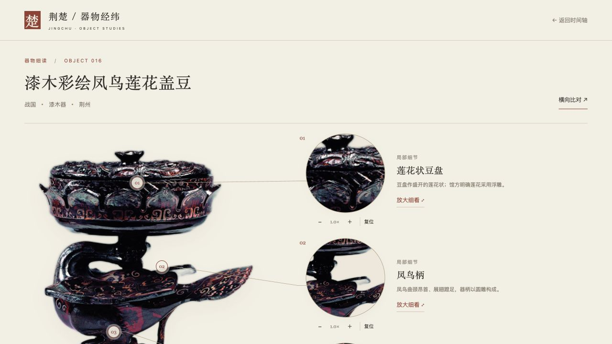
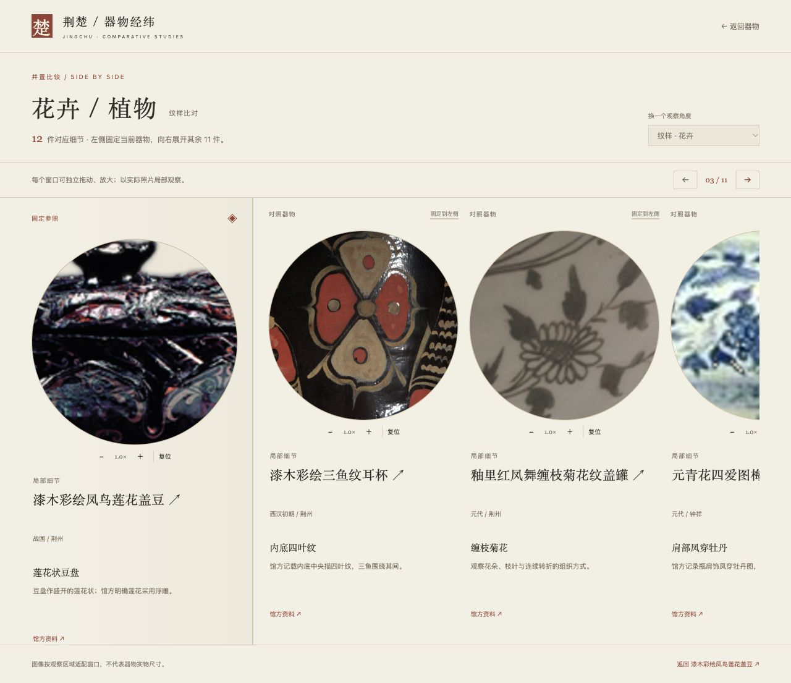

# 器物细读与比对检查

2026-10-01，本地静态预览，Codex in-app browser。

## 已验证的交互

- 时间轴器物选择进入独立 `object.html?id=…`，147 条器物共用同一页面结构。
- 莲花盖豆：莲花、凤鸟、蛇座的观察窗按原图上下位置排序，连线指回对应部位；圆窗可缩放、拖动，编号和“放大细看”打开大图观察区。
- 大图“＋”由 1.0× 变为 1.3×；方向键移动；保存观察区域后，花卉比对页使用本次会话的视口。概览标注仍保持原始位置。
- 花卉/植物：当前器物固定左侧，右侧有 11 件；下一件按钮滚动右侧，参照不动。将三鱼纹耳杯固定到左侧，数量和特征保持不变。
- 色彩“赤红”显示 18 件整器，材质“漆木”显示 48 件整器。纯数据检查遍历了 955 组器物/特征组合。
- 三维时间轴选花卉、跳到清代、进入斗彩折枝花纹碗，再返回：仍为三维视图、12 件匹配，浏览滑块返回前后均为 82.7。
- 430 × 900 手机视口：详情页和比对页文档宽度均为 430，无页面横向溢出；比对右侧有独立滚动空间，固定参照位于 x=14。临时视口已重置。
- 曾侯乙编钟详情 → “探索编钟的声音” → 独立原有三维体验；模型载入完成。播放《楚歌》后显示“正在演奏”，停止恢复待播放状态；方向键可选钟、回车敲击。控制台没有报错。播放逻辑另以模拟音频时钟检查，未作声学测量。

## 数据及资产

- 147 件器物、613 条观察记录的坐标、来源、所属特征及唯一编号全部通过检查。
- 花卉 12 件、合并去重鸟类 30 件；误标修订见 `motif-review.json`。
- 613 条观察记录包括全貌、器表和有限可见区域，并非全部都是可辨的单独纹样。
- 原有 2D/3D 布局回归检查通过，覆盖 320–1600 px 与 70 个特征布局。
- 编钟 49 个模型钟体均存在，各自有不同录音；457,472 个三角面保留材质和 UV，模型资源本地有效。
- 《楚歌》24 秒、20 次敲击，音高、休止、停止和解码取消检查通过。

## 图像限制

所有细节都来自现有照片。暗部、低分辨率以及当前角度未显示的纹饰会注明限制，放大不补绘。圆形观察窗可以移动，不能当作文物纹样的精确分割标本。

